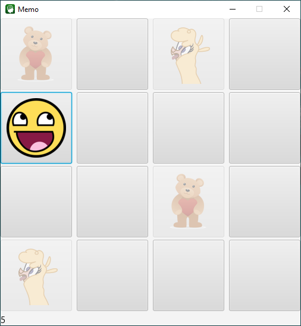

#  Game memo 

## For installation and run command below
 [Download](https://github.com/Bartosz95/game-memo/archive/master.zip) and unzip or clone repository from github:
```shell script
git clone https://github.com/Bartosz95/game-memo/archive/master.zip
```
Change directory to game-memo/ :
```shell script
cd game-memo/
```
Build jar file and run:
```shell script
./gradlew run
```
## Use application
When application has started at first will be visible menu view.
#### Menu
Main looks like below. Like it see it included 3 buttons: 
 * PLAY - run the game with is presented in section **Game**,
 * Options - run option menu with is presented in section **Option's menu**,
 * Exit Game - exit the game.
 


### Game
In game view you see a button's matrix. Main rule of memo game is matched two the same pictures each other. Score is display in bottom-left corner. If you wont to go to main menu you must win a game or run it again.


### Option's menu
Option's menu included 2 things. In ChoiceBox provides choice how many picture's couples  is necessary to match. Great things is that algorithm lay a pictures always in rectangle shape. That introduces necessity choice if gamer prefer vertical placement of pictures. Button **Back to menu** moves to main menu.

